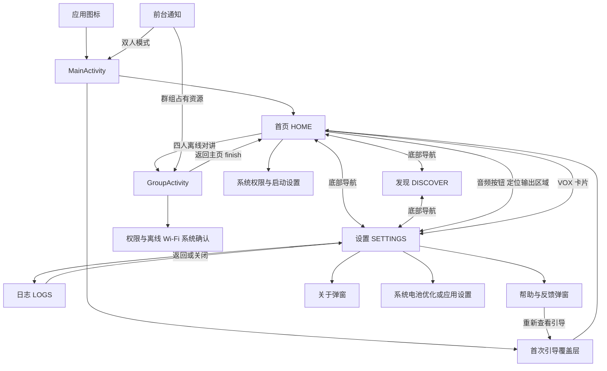
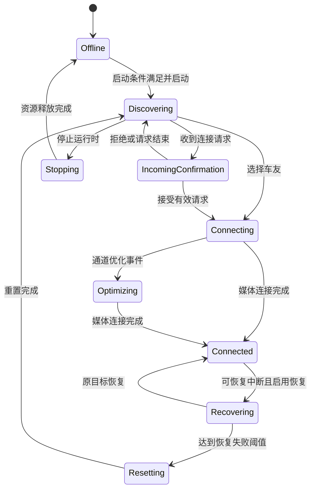

# 摩声 UI 重设计基线：页面、状态、交互与视觉

这份文档供设计师和开发者调整 UI 使用：先了解现有页面和操作，再按状态补齐设计稿。**它描述当前实现，不是新 UI 方案，也不授权修改通话行为。**

- 对应版本：`1.3.0+aee3b3f`，Android versionCode `4`。
- 固定源码基线：[`0f5e7b778ee0b945725c9506055d6137a7faf546`](https://github.com/g95809080-cmyk/moto-intercom/tree/0f5e7b778ee0b945725c9506055d6137a7faf546)，2026-09-20 发布后的 main。
- 范围：Android 生产入口。iOS、历史 PRD 和 Compose Preview 的示例文案不作为已上线事实。
- 方法：源码静态核对；本轮未运行手机或模拟器，因此没有截图或视觉验收结论。后续源码变化请按上述基线比较。

## 1. 页面地图

当前有 **4 个主路由 + 1 个独立群组 Activity + 引导与弹窗**。没有统一的 Compose Navigation / NavHost；双人部分由 `MainScreen.showPage` 切换 View 容器，里面嵌入 Compose 页面。群组单独使用 `GroupActivity.setContent`。

图中的系统页面是 Android / 厂商提供的界面，不能当成 App 内可自由设计的页面。主路由切换不停止通话；群组返回也不等于退出房间。

| 编号 / 页面 | 当前内容结构 | 主要入口与操作 | 状态依赖 |
| --- | --- | --- | --- |
| P01 首页 | 品牌头部、四人入口、深色连接状态卡、音频信息、静音/主按钮/音频设置、VOX 卡、条件提示 | 启动/结束；发现车友；静音；音频设置；VOX 设置；Wi-Fi/权限设置；群组入口 | `HomeScreenUiState`、`HomePresentation`、`IntercomState`、音频快照 |
| P02 发现车友 | 标题操作区、深色搜索状态、雷达、启动/Wi-Fi 提示、车友卡列表、重新扫描 | 返回；详情；连接；已配对管理；扫描 | `DiscoverPresentation`、`RiderPresence`、连接请求待确认标志 |
| P03 设置 | 昵称；VOX；音频输出；连接与设备；设备状态；两个后台设置面板；日志/帮助/关于与版本 | 保存昵称；切换音频；开关 VOX/自动重连；授权；打开系统设置 | `SettingsScreenUiState`、偏好值、Service 事实 |
| P04 日志 | 返回设置、范围说明、深色等宽日志窗、复制全部、关闭 | 复制到剪贴板；返回/关闭都去设置 | `LogsScreenUiState`；当前界面会话最多 300 条日志 |
| P05 四人离线对讲 | 返回、标题/状态；空闲时创建与输入六位码；运行时房间码、候选房主、成员、语音状态、音频与退出操作 | 创建/加入/选房主；复制码；自己静音；本机屏蔽成员；房主管理；退出 | `GroupServiceState`、`GroupSessionSnapshot`、`GroupPhase` |
| O01 新手引导 | 全屏图文介绍；开始/跳过；真实按钮高亮教学 | 开始教学；执行当前目标；跳过/返回结束教学 | `OnboardingPhase` + 当前页面/权限/会话事实 |

源码：[MainScreen](../../app/src/main/java/com/kuma/motointercom/MainScreen.kt)、[MainActivity](../../app/src/main/java/com/kuma/motointercom/MainActivity.kt)、[HomeScreen](../../app/src/main/java/com/kuma/motointercom/HomeScreen.kt)、[DiscoverScreen](../../app/src/main/java/com/kuma/motointercom/DiscoverScreen.kt)、[SettingsScreen](../../app/src/main/java/com/kuma/motointercom/SettingsScreen.kt)、[LogsScreen](../../app/src/main/java/com/kuma/motointercom/LogsScreen.kt)、[GroupActivity](../../app/src/main/java/com/kuma/motointercom/GroupActivity.kt)。

## 2. 导航、返回与恢复

### 主界面

- `MainRoute` 为 `HOME / DISCOVER / SETTINGS / LOGS`。底部只有首页、发现、设置三项，日志属于设置子页。
- 保存当前路由、各页滚动位置、昵称草稿、大屏选中的车友身份。切页保存旧位置并重新创建页面；重复点击当前页不重建。
- 从首页音频按钮进入设置会定位到音频输出区域；VOX 卡进入设置，但没有同样的 VOX 定位参数。
- 在发现页点击连接，不以点击动作立即判定成功；等待状态回传满足 `shouldNavigateHomeAfterDiscoverConnect` 后回首页。请求待定期间禁止重复连接；候选消失还有 2 秒宽限处理。
- 默认首页系统返回交给 Activity / 系统处理，不隐式发出停止或断开命令。

返回优先级：有来电确认时忽略主界面返回；没有来电确认时，可见引导先处理返回并结束教学；之后依次关闭导航面板、关闭受管理的临时弹窗、日志→设置、发现/设置→首页、首页→系统默认。`关于`使用原生弹窗自身的默认关闭行为，不在 `helpDialog` 等统一管理列表中。

### 群组与通知

- `GroupActivity` 是独立 Activity，不属于 `MainRoute`。页面“返回主页”调用 `finish()`；若从通知单独进入，返回行为由实际 Activity 栈决定，不能假定总有一个首页实例在下方。
- `onStop` 只移除监听并解绑 Service，不派发 `Leave`。显式“离开 / 取消”才结束参与；房主的“结束全队对讲”先弹确认框。
- 输入房间码只用 `remember`，提交加入后清空，不在保存状态里恢复。Service 存活时重新打开页面读取当前房间；进程消失后需要重新创建/加入。
- 常驻通知点击：群组占用资源时打开群组，否则打开 MainActivity；来电通知还提供“拒绝本次 / 接受”动作。
- Launcher 只公开 MainActivity；GroupActivity `exported=false`。当前清单没有房间码 URL 深链或扫码入口。

源码：[MainUiPolicy / resolveBackNavigation](../../app/src/main/java/com/kuma/motointercom/MainUiPolicy.kt)、[Manifest](../../app/src/main/AndroidManifest.xml)、[IntercomService / buildNotification](../../app/src/main/java/com/kuma/motointercom/IntercomService.kt)。

## 3. 双人状态机如何投射到 UI

`SessionOrchestrator` 是产品状态写入方，Service 执行连接、音频等副作用，UI 观察并发出用户意图。页面状态不能替代会话状态；重新进入页面不应重新发起连接。

| 产品状态 | 首页主文案（当前映射） | 首页按钮显示 / 实际动作 | 发现页与设计注意 |
| --- | --- | --- | --- |
| `Offline` | 点击下方启动摩声 | 启动摩声 / `START` | 可进入发现页，但需先启动；缺权限时启动按钮仍可点，负责进入授权流程 |
| `Discovering` | 正在寻找附近 MotoCom 车友 | 结束对讲 / `STOP_RUNTIME` | 可选可用车友；出现发现 CTA；扫描与空列表状态 |
| `IncomingConfirmation` | 收到附近车友的连接请求 | 结束对讲 / `STOP_RUNTIME`；前方确认框优先 | 接受/拒绝必须明确操作；不能用返回替代接受 |
| `Connecting` | 正在建立连接 | 结束对讲 / `DISCONNECT_CURRENT` | 当前目标只读，不允许选择其他车友 |
| `Optimizing` | 正在优化连接通道 | 结束对讲 / `DISCONNECT_CURRENT` | 保持同一目标，不是新的配对邀请 |
| `Connected` 且音频未就绪 | 正在等待音频就绪 | 结束对讲 / `DISCONNECT_CURRENT` | 细文案“等待远端首帧与本地音频路由确认”，不能展示可正常互听的完成态 |
| `Connected` 且音频就绪 | 语音通道已连接 / 对讲已就绪 | 结束对讲 / `DISCONNECT_CURRENT` | 显示真实车友、实际通道和音频事实 |
| `Recovering` | 正在恢复原车友连接 | 结束对讲 / `DISCONNECT_CURRENT` | 锁定原车友，暂不能换目标 |
| `Resetting` | 正在重置无线连接 | 结束对讲 / `STOP_RUNTIME` | 自动恢复连续最终失败达到阈值 3 后可进入重置；不是普通搜索 |
| `Stopping` | 正在结束对讲 | 停止中… / `NONE`，禁用 | 明示正在释放连接和音频资源 |

注意：首页统一显示“结束对讲”，但动作有“断开当前车友”和“停止整个运行时”两种。`IntercomActionPolicy.primaryIntercomActionLabel` 的内部动作名称不能直接当成当前首页按钮文本。

这是设计用主路径图，未展开每个超时、失败、主动断开以及各状态停止的边；完整转换以 reducer 和 orchestrator 的事件守卫为准。`Connected` 下的音频就绪是额外事实，不是新 `SessionState`。

源码：[IntercomState](../../app/src/main/java/com/kuma/motointercom/IntercomState.kt)、[IntercomStateMachine](../../app/src/main/java/com/kuma/motointercom/IntercomStateMachine.kt)、[SessionOrchestrator](../../app/src/main/java/com/kuma/motointercom/SessionOrchestrator.kt)、[IntercomActionPolicy](../../app/src/main/java/com/kuma/motointercom/IntercomActionPolicy.kt)、[MainUiPolicy / homePresentation](../../app/src/main/java/com/kuma/motointercom/MainUiPolicy.kt)。

## 4. 发现列表与配对交互

| 对象或状态 | 当前显示和操作规则 |
| --- | --- |
| 可用的首选已配对车友 | 排序最前；显示已配对/首选事实 |
| 其他可用已配对车友 | 排在首选后 |
| 未配对候选 | 排在可用已配对后 |
| 离线已配对记录 | 最后；没有可用通道不能连接 |
| 同名车友 | 优先附设备名，仍重名则附 deviceId 末 4 位；昵称不能作为唯一选择身份 |
| 可连接按钮 | 仅 `Discovering` 且 `isSelectable`、deviceId 非空才出现；请求待定时禁用 |
| 点击卡片 | 查看详情；Expanded 且身份/会话 ID 有效时使用详情区，其他情况使用弹窗 |
| 已配对管理 | 设为/取消首选；忘记配对前二次确认；操作前重查当前记录 |
| 已连接/恢复/停止等 | 列表保留但只读，用原因文案解释为何不能换人 |

## 5. 四人房间状态与角色

群组使用独立 `GroupSessionOrchestrator`；UI 通过 `GroupServiceState` 读取快照。`busy` 是 Service 准备过程的额外状态，不能只判断 `phase==IDLE` 来显示创建入口。双人和群组共享底层资源且互斥，切页本身不转移资源所有权。

| `GroupPhase` | 当前呈现 / 用户动作 |
| --- | --- |
| `IDLE` | 非 busy 时显示创建、六位数字输入、加入、权限设置。失败/结束信息可保留在顶部 |
| `CREATING` | 正在创建离线房间；房主可以结束/取消 |
| `SEARCHING` | 正在查找并验证附近房间，可显示验证进度；可取消 |
| `SELECTING` | 多个房间使用同一码，显示房主昵称 + 实例末 8 位，选择对应房间 |
| `JOINING` | 加入离线 Wi-Fi 系统确认，随后验证并加入；可取消 |
| `IN_ROOM` | 房主单人等待、成员列表、语音就绪/待确认、音频操作 |
| `RECONNECTING` | 原网络/原房间恢复；不切换到随机新房间 |
| `WAITING` | 房间已满或繁忙，等待空位并重试；允许离开 |

主路径：创建→`CREATING`→`IN_ROOM`；输入码→`SEARCHING`→（一个结果直接加入 / 多个结果 `SELECTING`）→`JOINING`→`IN_ROOM`。无验证结果、被移出、房主结束等终态回 `IDLE` 并显示原因。显式离开停止重试；恢复/等待可重试进入加入流程。

| 范围 | 可见操作与语义 |
| --- | --- |
| 自己 | “静音我的麦克风 / 打开我的麦克风”，控制发送 |
| 其他成员 | “在本机静音此成员 / 恢复本机收听”，只控制本机收听，不是全队禁言 |
| 房主额外操作 | 移出成员；解除移除限制；结束全队。当前“移出”直接发事件，没有二次确认弹窗 |
| 房主结束确认 | “结束全队对讲？”；确认“结束房间”或“继续对讲”；结束后所有成员离开且当前码失效 |
| 房间码 | 展示/复制；加入输入只接受 6 位 ASCII 数字后才可提交 |
| 音频输出 | 蓝牙耳机、手机听筒/有线耳机、手机扬声器；勾选值是首选路由，旁边另有实际音频状态 |
| 声控 | 开关 VOX；群组当前页没有灵敏度滑条 |

成员卡区分 `RESERVED` 的“重连中，席位暂时保留”、音频暂不可用、已加入；`WAITING` 成员不出现在该列表。未确认的双向链路以“甲 ↔ 乙：语音待确认”列出。

**全队就绪要求**：至少 2 位 admitted 成员，无 reserved 成员，所有 active 成员音频可用，而且完整 `n×(n−1)/2` 条双向链路均被双方确认。仅房主存在、仅网络连通或仅某一成员可听，不能显示“全队语音已就绪”。

源码：[GroupSessionOrchestrator](../../app/src/main/java/com/kuma/motointercom/group/GroupSessionOrchestrator.kt)、[GroupAccess](../../app/src/main/java/com/kuma/motointercom/group/GroupAccess.kt)、[GroupRoom](../../app/src/main/java/com/kuma/motointercom/group/GroupRoom.kt)、[GroupParticipation](../../app/src/main/java/com/kuma/motointercom/group/GroupParticipation.kt)。

## 6. 权限、引导、后台与其他弹层

### 两条启动权限链

双人：点击启动 → 核心权限与尚未询问的可选权限 → Wi-Fi 开关 → 系统位置开关 → 可选电池优化提示 → 在前台恢复时继续启动。核心权限拒绝会停止这次启动；已永久拒绝时引导到应用权限设置。电池豁免可跳过，不能做成通话的强制门槛。

群组：创建/加入 → 群组权限申请 → 前台恢复后重新校验 → 启动 Service。不是复用 `StartupAccessController`；蓝牙发现/广播参与群组必需权限集合。权限缺失会提示重试，页面另有系统应用设置入口。

| 类型 | 双人 | 群组 |
| --- | --- | --- |
| 麦克风 | 必需 | 必需 |
| 电话状态 | 核心必需 | 申请，但不在 `hasGroupPermissions` 必需集合 |
| API 33+ 附近 Wi-Fi | 必需 | 必需 |
| API 32 及以下定位权限 | 精确位置；API 31–32 同时请求粗略位置 | 精确位置 |
| API 31+ 蓝牙 | CONNECT 可选 | CONNECT / SCAN / ADVERTISE 必需 |
| API 33+ 通知 | 可选 | 请求但不作为群组必需条件 |
| 电池优化豁免 | 首次启动可建议，设置可再次打开 | 本页面没有同样的启动提示链 |

后台设置实际是两张卡：第一张实时查询 `isIgnoringBatteryOptimizations` 并显示白名单状态；第二张固定提示“需在系统设置中确认”，提供打开应用设置按钮。**没有“我已确认”开关，也没有保存厂商后台设置确认值**；不能把第二张卡画成 App 已自动验证成功。

### 引导与弹窗清单

| 弹层 | 触发 / 退出 |
| --- | --- |
| 图文引导 INTRO | 首次启动或帮助内重播；开始进入 TOUR，跳过/系统返回进入 COMPLETE |
| 高亮教学 TOUR | 按真实事实选 PERMISSION / PERMISSION_SETTINGS / WIFI / START / DISCOVER / SCAN；来电或连接忙时隐藏；Connected 且音频就绪才自动完成 |
| 来电确认 | 显示实际车友；接受/拒绝；不可用外部点击或返回跳过确认 |
| 补齐通话权限 / 打开位置 | 去系统设置或暂不设置；未满足条件不启动 |
| 电池优化豁免 | 去设置或暂不设置；与手机后台“无限制”分别解释 |
| 车友详情 / 配对管理 / 忘记确认 | 从发现卡进入；管理首选、忘记记录 |
| 帮助与反馈 | 发送反馈调用 Android 分享选择器；不自动发送、不自动附日志；另有重新查看引导 |
| 关于 | 展示应用信息与实际版本，关闭 |
| 结束全队确认 | 房主显式结束时显示，见群组章节 |

源码：[StartupAccessController](../../app/src/main/java/com/kuma/motointercom/StartupAccessController.kt)、[PermissionPolicy](../../app/src/main/java/com/kuma/motointercom/PermissionPolicy.kt)、[OnboardingPreferences](../../app/src/main/java/com/kuma/motointercom/OnboardingPreferences.kt)、[OnboardingGuide](../../app/src/main/java/com/kuma/motointercom/OnboardingGuide.kt)。

## 7. 音频状态不能合并成一个“已连接”图标

设计稿至少分开：产品连接状态、音频是否就绪、首选输出、实际输出、自己静音、VOX 开关与瞬时门控状态。主页静音按钮在非 Offline / 非 Stopping 时启用，不仅限于已连接。

`AudioRouteSelection`：`BLUETOOTH / EARPIECE / SPEAKER`，默认蓝牙。`AudioControlSettings` 默认未静音、VOX 开、灵敏度 50（0–100）。设置页 VOX 关闭时禁用灵敏度滑条。

| `VoxRuntimeState` | 设计需要表达的区别 |
| --- | --- |
| `IDLE` | 空闲，尚未运行声控 |
| `DISABLED` | VOX 关闭，不代表麦克风被静音 |
| `MUTED` | 用户主动静音，优先于声控 |
| `LISTENING` | 等待声音触发，门未打开 |
| `OPEN` | 声控已触发 |
| `HANGOVER` | 触发后的短暂保持期 |

源码：[AudioControlState](../../app/src/main/java/com/kuma/motointercom/AudioControlState.kt)、[AudioRouteState](../../app/src/main/java/com/kuma/motointercom/AudioRouteState.kt)。

## 8. 现有配色与组件风格

总体是浅灰绿背景、白色圆角面板、深色连接控制台、亮黄绿色重点按钮。Compose 固定使用 `lightColorScheme`，XML 主题也为 Light；当前没有独立深色主题或动态取色分支。

| 色值 | 资源名（省略 motocom_） | 主要用途 |
| --- | --- | --- |
| `#F3F4EF` | background | 页面与启动背景 |
| `#FFFFFF` | surface | 白色面板 |
| `#ECEEE7` | surface_soft | 次级面板/按钮 |
| `#C3F36B` | accent_green / accent_green_alt | 品牌亮绿、主控强调 |
| `#416722` | accent_green_dark | Material primary / secondary / tertiary |
| `#EAF3DB` | accent_green_soft | 浅绿容器 |
| `#DFEDCB` | accent_green_pressed | 按压色 |
| `#18201D` | text_primary / console | 主文字、深色控制台 |
| `#626B62` | text_secondary | 次级文字 |
| `#727B72` / `#53604F` | text_muted / text_muted_accessible | 弱文字、可读性调整色 |
| `#DFE3D9` / `#DDE2D6` | border / disabled | 边界、禁用 |
| `#C0CCC0` | on_console_secondary | 深色卡上的辅助文字 |
| `#66000000` | scrim | 遮罩 |
| `#B3261E` | Theme 中直接定义 | Material error |

Material 默认按钮采用深绿 primary；首页部分主控/日志复制等显式用亮绿。因此“主题 primary”与“所有主按钮都亮绿”不是一回事。

| 组件层 | 当前实现与重设计影响 |
| --- | --- |
| 页面容器 / 主导航 | XML `activity_main.xml` + View，手工安全区和切页；底部导航是原生 Button |
| 主四页内容 | Compose；大量直接指定 `colorResource`、`fontSize`、圆角与页面私有组件，只改 Theme 不会覆盖所有样式 |
| 首页 | 深色 Console、音频卡、三个主要控制、圆形主按钮、VOX 状态与音量可视元素 |
| 发现页 | 深色状态/雷达、白色车友卡、身份/通道标识、连接按钮与配对文字按钮 |
| 设置页 | 私有 `SettingsPanel / SettingsSwitchRow / SettingsAudioRouteRow / SettingsVoxSlider` 等，不是统一组件库 |
| 群组页 | Material3 Button / OutlinedButton / TextButton / Card / OutlinedTextField / AlertDialog；纵向堆叠布局 |
| 其他弹窗 / 引导 | 主要为平台 `android.app.AlertDialog` 和动态 View；群组结束弹窗才是 Compose Material3 |
| 图标与图片 | `res/drawable` 中矢量/shape 资源；`drawable-nodpi/onboarding_guide.png` 图文引导；启动图标在 mipmap |
| 日志 | 深色等宽字体窗口，可单独滚动；复制按钮 |

字体：SansSerif。Theme 显式设 titleLarge 22sp bold、headlineSmall 20sp bold、titleMedium 17sp bold；body 15/14/13sp；label 14/12sp bold。页面有直接字号覆盖，群组 `headlineMedium` 未在该 Theme 自定义而沿用 Material 默认。日志 13sp、行高 21sp、Monospace。

尺寸基准：内容最大宽 520dp；卡圆角 18dp（Theme 各 shape 档位都映射到同一圆角）；控件最小高度/图标按钮 48dp；默认主控 112dp、页水平边距 24dp、垂直 18dp、卡内边距 18dp、常规间距 12dp/大间距 22dp。底部项目最小高度 64dp、文字 12sp bold。群组另用内容最大宽 720dp、外边距 20dp、纵向间距 12dp、成员卡内边距 16dp。

源码：[颜色](../../app/src/main/res/values/colors.xml)、[尺寸](../../app/src/main/res/values/dimens.xml)、[MotoComTheme](../../app/src/main/java/com/kuma/motointercom/MotoComTheme.kt)、[XML 样式](../../app/src/main/res/values/styles.xml)、[主布局](../../app/src/main/res/layout/activity_main.xml)。

## 9. 屏幕适配与交互细节

- `AdaptiveWindow` 计算 Compact / Medium / Expanded；**当前所有宽度均显示底部导航，navigationRail 被设置为 GONE**。XML 有 rail/panel 资源不等于当前展示它们。
- Expanded 时首页/发现/设置增加右侧详情区，日志不显示；发现可显示选中的车友详情。不要仅凭旧布局资源画出平板侧栏导航。
- `values-sw320dp` 把水平边距改为 16dp、主控间距 0；`sw360dp` 改为 20dp、主控 96dp、部分间距 2–8dp；`sw480dp` 回调若干卡片间距；`sw600dp` 水平边距 32dp、垂直 24dp、面板宽 320dp。未覆盖项按 Android 资源限定规则继承，不是四套完全独立规格。
- 主界面处理系统栏、刘海、手势安全区；群组使用 `safeDrawingPadding + imePadding`。房间码输入键盘出现时仍要能访问加入/取消操作。
- 引导可滚动到真实目标，覆盖层会处理背后内容的可访问性；有来电时不抢确认焦点。主页面动画考虑系统是否关闭动画。
- 部分操作已有 contentDescription、Role、testTag；新稿应保留语义标识，不能把“有标识”等同于已经通过完整读屏或对比度验收。

源码：[AdaptiveWindow](../../app/src/main/java/com/kuma/motointercom/AdaptiveWindow.kt)、[sw320dp](../../app/src/main/res/values-sw320dp/dimens.xml)、[sw360dp](../../app/src/main/res/values-sw360dp/dimens.xml)、[sw480dp](../../app/src/main/res/values-sw480dp/dimens.xml)、[sw600dp](../../app/src/main/res/values-sw600dp/dimens.xml)。

## 10. 下一轮设计交付清单（建议，未实现）

建议先确定“双人和群组是否共用通话主页”“音频控制放哪里”“技术连接信息是否折叠”三项信息架构，再做视觉稿；这些属于下一轮方案，不是本次默认修改。

| 设计稿组 | 至少覆盖 |
| --- | --- |
| 启动 | 首次引导、跳过后启动、首次授权、拒绝/永久拒绝、Wi-Fi 关、位置关、可跳过的后台提示 |
| 双人首页 | 空闲、发现、来电、连接、优化、已连接待音频、可互听、恢复、重置、停止 |
| 发现 | 空列表、可连接、首选/已配对/离线、同名、请求待定、只读、详情、忘记确认 |
| 群组 | 建房准备、搜索、同码多房、系统网络确认、房主单人等待、2/3/4 人、局部链路待确认、满员等待、重连保留、被移出、结束 |
| 音频 | 默认/不可用路由、实际与首选不一致、自己静音、本机屏蔽成员、VOX 六状态 |
| 设置与辅助 | 昵称编辑/保存反馈、日志空/有内容/复制反馈、帮助、关于、后台两种状态来源 |
| 跨页面 | 通话中切页、返回不挂断、通知重返、旋转恢复、键盘、长昵称、大字体、小屏/大屏 |

未来实现的关键约束：继续由产品状态机判断连接和目标；不得用 UI 点击直接置“已连接”；不得因为离开页面就销毁通话；不得将本机屏蔽包装成全队禁言；后台厂商设置不能显示为已自动验证；区分停止与断开、已连接与音频就绪。

本轮只新增梳理文档及 README 索引，不改变 UI、状态机、导航、权限、版本号或发布产物。现有自动化入口可从 `app/src/test` 与 `app/src/androidTest` 下的 MainUiPolicy、HomeScreen、Discover、Settings、Onboarding、StartupAccess、Group 等相关测试查找；实际改版时按改变的行为选择回归。
