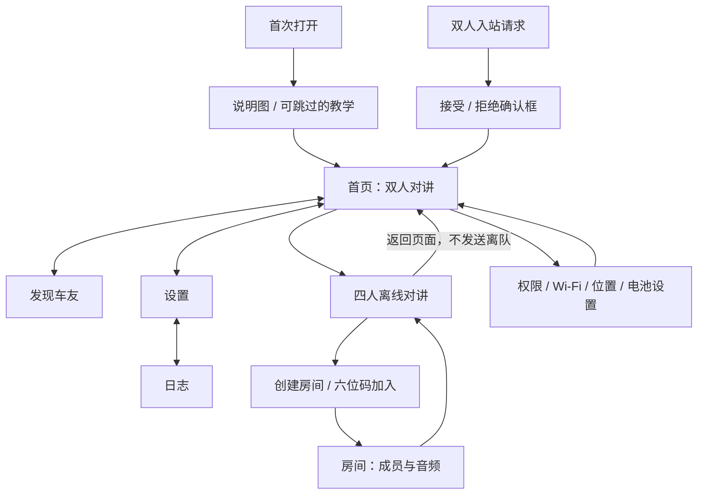

# MotoCom UI 与交互现状梳理

日期：2026-09-30。方法：Product & App Architect，依据当前仓库进行静态梳理。

代码基线：`main`，HEAD `0f5e7b778ee0b945725c9506055d6137a7faf546`。工作区版本配置为 1.3.0 / versionCode 4；这不代表当前代码已安装在设备上或完成发布。

用户已明确排除 `2026-07-17-motocom-ui-redesign-prd.md`，本文不采用其中的页面、技术栈或交互约束。本文记录当前事实并提出方案建议，不替代既有产品契约、Linear 路线图或架构审批。

## 1. 判断与改造方向

当前 Android 已有较完整的双人对讲流程，并新增独立群组页面。主要整理方向是让用户理解当前模式、通话是否仍在进行、按钮会产生什么结果，以及设置影响哪一场通话。应在既有结构上完善信息与交互，不需要先更换导航框架。

建议保留首页、发现车友、设置三个主入口，日志作为设置的子页面，群组保持独立流程。首页增加明确的“双人对讲”语境及当前群组通话入口；群组使用与主页面一致的组件、间距、状态和音频术语。iOS 单独列出能力差异，不将 Android 的界面布局视为其已实现能力。

## 2. 依据与证据范围

已读取 MainActivity、MainScreen、MainUiPolicy、IntercomActionPolicy、HomeScreen、DiscoverScreen、SettingsScreen、LogsScreen、GroupActivity、StartupAccessController、OnboardingGuide、IntercomService 群组入口及 iOS MotoComRootView 的相关代码；同时参考首次引导记录和 KUM-56 群组实施设计。

本文能确认代码中的入口、事件、文案、导航、校验与生命周期意图。尚未运行真实页面，因此不能判断实际布局、遮挡、对比度、动画、读屏顺序、系统权限弹窗及设备连接体验，也不能据此宣称视觉验收通过。

## 3. 信息架构

Android 的 MainActivity 管权限、设置持久化、服务绑定和用户意图转发；MainScreen 管页面路由、页面状态与导航外壳，Compose 页面嵌入现有 View 宿主。GroupActivity 是独立 Compose 页面，订阅同一 IntercomService 的群组状态。页面切换和通话生命周期是两件独立的事。

iOS 当前使用 NavigationStack 中的一个 List，集中展示状态、设备、附近设备、操作及已配对记录；不是 Android 三个主页面的同构实现。

## 4. 页面与操作清单

| 页面 / 图层 | 用户任务 | 当前主要操作与反馈 |
| --- | --- | --- |
| 首次说明与教学 | 学会启动和发现双人车友 | 开始、跳过、授权、Wi-Fi 设置、启动、进入发现、扫描；忙碌状态让位；帮助中可重放 |
| 首页 | 启动双人对讲，了解连接和音频状态 | 主按钮、发现入口、自静音、音频设置、VOX 设置入口、四人离线对讲入口；展示目标、通道和音频状态 |
| 发现车友 | 找到并选择本次目标 | 启动、重新扫描、Wi-Fi 设置、查看车友信息、连接、设首选或忘记配对；非发现状态只读 |
| 设置 | 配置个人与音频偏好，查看设备准备情况 | 昵称保存、VOX 开关和灵敏度、音频路由、自动重连、权限、两种后台设置、日志、帮助、关于 |
| 日志 | 获取本次界面会话诊断信息 | 查看、复制全部、返回设置；无内容时不提供有效复制 |
| 群组准备 | 创建或加入附近房间 | 创建、六位码输入与加入、系统权限设置；多个候选时选择真实房间 |
| 群组房间 | 看成员、控制自己的收发、管理房间 | 复制码、自静音、本机屏蔽成员、音频路由、VOX；房主移除成员、解除限制、结束全队；成员离开或取消 |
| 双人连接确认框 | 决定是否接入车友 | 接受或拒绝；系统返回不能绕过确认；请求取消后按当前请求标识撤销弹窗 |
| iOS 根页面 | 发现和连接跨平台设备 | 请求麦克风权限、发现、连接、准备 iPhone 主机、打开系统网络设置、返回继续、接受连接、结束对讲 |

## 5. 核心任务流程

### 5.1 双人启动与权限

点击启动后，StartupAccessController 按当前条件推进：必要与尚未询问的可选权限 → Wi-Fi 开关 → 系统位置信息 → 首次电池优化豁免提示 → 启动运行时。电池优化提示允许暂不设置；必要权限或位置条件未满足时停止本次推进，说明原因并给重试或系统设置入口。系统页面返回后重新读取条件，启动必须来自有效的用户意图。

首次说明图和教学只负责解释真实操作，不自动选择车友或接受请求。教学完成不等于通话成功；Connected 且音频就绪才是首次通话体验成功的判据。

### 5.2 发现、连接与恢复

进入发现页不等于启动发现。Offline 可启动；Discovering 中可扫描与选择可连接车友。列表依首选在线配对、其他在线配对、陌生车友、离线配对排序，并通过设备名称或设备 ID 后缀区分同名车友。

点击连接前重新核对当前页面、产品状态和最新 Presence；派发后等待服务状态，不把“点击成功”当作“连接成功”。服务进入连接、优化、连接成功或恢复等适用状态后回首页。连接过程中与恢复过程中不开放随意切换目标。

入站请求由独立确认框接受或拒绝。恢复状态表示尝试原车友，不能把附近其他设备当成恢复成功。媒体已连接但音频尚未就绪时，首页明确显示等待音频确认。

### 5.3 双人主按钮的实际含义

| 当前状态 | 实际事件 | 当前首页按钮文案 | 建议文案方向 |
| --- | --- | --- | --- |
| Offline | 启动运行时 | 启动摩声 | 启动双人对讲 |
| Discovering | 停止运行时 | 结束对讲 | 停止寻找车友 |
| IncomingConfirmation | 停止运行时；确认框优先处理 | 结束对讲 | 保持接受 / 拒绝为当前主要操作 |
| Connecting / Optimizing | 断开当前目标 | 结束对讲 | 取消连接 |
| Connected | 断开当前车友 | 结束对讲 | 断开当前车友 |
| Recovering | 撤销当前车友连接 | 结束对讲 | 停止重连 |
| Resetting | 停止运行时 | 结束对讲 | 停止摩声 |
| Stopping | 不派发新操作 | 停止中… | 保留停止中并禁用 |

“断开当前车友”与“停止运行时”的区分已经存在于 IntercomActionPolicy。建议首先使用与真实动作一致的文案；具体状态用词需在改造方案中最终确定，不改变事件语义。

### 5.4 群组创建与加入

首页入口打开 GroupActivity。空闲时提供创建和六位数字码加入；加入按钮在六位有效数字时才可用。点击后权限流程完成，再向服务发送显式群组启动命令。服务再次检查权限、现有双人运行时、群组运行时及未释放资源；冲突时提示先结束当前对讲并等待释放，当前代码不会自动抢占或结束通话。

多候选时选择实际房间。房间码在运行时查看和按用户点击复制。成员卡区分自己、房主、重连占位和音频暂不可用；未确认链路单独显示，不能仅凭成员名单判定全队语音就绪。

### 5.5 群组音频、成员管理与退出

自静音影响自己的发送；“在本机静音此成员”影响自己的收听；移出成员影响该成员参与房间，三种操作必须维持清楚的名称与作用范围。房主结束全队有确认框，说明全员离开和房间码失效；普通成员可以离开或取消。

返回主页、Activity 重建或普通后台切换只解除界面订阅，不发送 Leave。再次打开群组页读取服务快照。因此“返回主页”不能表达为“退出对讲”。

### 5.6 设置与持久化

昵称需非空且不超过 64 个 Unicode code point，保存失败保留草稿与提示。主设置页保存 VOX、路由和自动重连偏好，并转发到双人服务接口。群组启动时读取保存的路由与 VOX；房间中的 groupRoute / groupVox 修改当前群组运行时和界面快照，没有在这些入口中保存为全局偏好。

系统电池优化豁免与手机后台、自启动设置分开呈现，不能把其中一项当作另一项已完成的证据。日志是设置的子页面；帮助可重放引导或发起系统分享反馈，反馈不会自动附带日志。

### 5.7 iOS 当前体验

稳定身份未准备时禁用发现和主机准备。发现先请求麦克风权限；网络需要手动操作时提供系统设置与“已完成，继续发现”。入站确认状态开放“接受连接”，根页面没有独立的“拒绝连接”按钮。已配对记录在根页面只展示，没有 Android 的首选和忘记配对操作入口。状态标题直接使用英文 phase.rawValue。

这些是当前 UI 的能力差异，不意味着底层协议或平台能力已完整验证，也不据此新增跨平台功能要求。

## 6. 导航、保留和失败状态

| 场景 | 当前代码行为 | 改造必须说明的内容 |
| --- | --- | --- |
| Android 返回 | 确认框优先；关闭导航或临时弹窗；日志回设置；发现/设置回首页；首页系统默认 | 当前通话是否继续与返回目标 |
| 页面 / Activity 重建 | 主路由与滚动按有效进程会话恢复；通话事实从服务读取 | 不用旧页面文本伪造通话状态 |
| 群组返回、后台或重建 | 不离队；重新进入订阅当前房间 | 首页能否看到并返回仍在进行的群组 |
| 群组权限拒绝 | 提示授权后重试；提供权限设置 | 保留或恢复用户本次加入意图与输入 |
| 群组启动或资源冲突 | 状态文本提示；不自动切换模式 | 当前占用模式、下一步入口与等待释放 |
| 双人发现为空或仅离线配对 | 搜索 / 没有可连接车友及扫描操作 | 用户能做什么与准备条件 |
| Service 绑定断开 | 主页面清除服务事实；群组提示重新创建或加入 | 与普通链路重连区分 |
| 已连媒体、音频未就绪 | 首页等待音频确认；群组列出未确认关系 | 避免提前宣布可以正常通话 |

## 7. 优先确定的交互方案

以下是代码事实对应的设计建议，尚未进行设备视觉验收。

| 优先顺序 | 事实与影响 | 推荐方案 | 依据 |
| --- | --- | --- | --- |
| 1 | 主按钮同一“结束对讲”文案对应断开目标或停止运行时，用户无法从文案判断下一步 | 按真实动作区分取消连接、断开车友、停止寻找与停止重连；状态说明保持简短 | MainUiPolicy / IntercomActionPolicy |
| 2 | 群组返回主页不离队；首页仍呈现双人界面与固定群组入口，未传入群组快照 | 首页显示当前群组仍在通话及“返回房间”；启动其他模式前说明占用状态，保持既有互斥规则 | MainActivity / HomeScreen / GroupActivity / IntercomService |
| 3 | 群组加入点击立即清空输入，后续权限拒绝或启动失败需重新输入；输入使用 remember，重建不保留 | 普通失败保留当前页面输入供重试；离开、成功或进程结束时清除；不写磁盘或跨进程恢复码。Activity 重建保留策略仍遵守既有群组契约 | GroupActivity，KUM-56 design |
| 4 | 主设置持久化音频偏好，房间音频操作只修改当前群组 | 明示“默认音频设置”和“本次房间音频”；保持现有作用范围，避免静默改变保存规则 | MainActivity / IntercomService |
| 5 | 首次引导、品牌语、关于和帮助仍主要介绍一对一；首页却已经提供四人功能 | 产品级介绍说明双人与四人两种模式；双人发现页可以继续明确其一对一范围；补充简短群组使用说明 | strings.xml / OnboardingGuide / HomeScreen |
| 6 | 设置页包含 Attempt、产品状态和发现候选等诊断内容，和用户偏好混在同层 | 将技术事实归入诊断入口；常用设置优先呈现昵称、音频与后台准备 | SettingsScreen |
| 7 | iOS 原始英文状态和入站接受操作与 Android 体验不一致 | 先明确 iOS 本轮是否纳入改造；纳入时映射用户状态文案并设计拒绝或取消路径，核实底层事件支持 | MotoComRootView / SessionCoordinator |

## 8. 推荐方案草稿

默认建议：保留现有导航结构，先改 Android，iOS 作为独立后续范围。

- 首页明确“双人对讲”，状态卡首先回答“是否已可通话”和“正在和谁通话”；实际通道与媒体诊断降低到次要位置。
- 群组入口根据真实快照显示“创建 / 加入四人房间”或“返回正在进行的房间”；页面返回继续通话的说明与离队操作各自清楚。
- 主按钮按状态说明真实动作；同一功能在首页、群组、设置中使用统一术语。
- 群组准备突出创建和输入码两项；房间页突出成员、谁暂时无法互听、自静音与退出，房主管理操作放到对应成员上下文。
- 设置保留常用偏好、权限和后台准备；诊断事实与日志作为二级信息。
- 当前房间音频设置明确仅本次生效；不顺带修改既有持久化或自动重连产品规则。

上述建议不要求新增账号、云端或替换协议。已有接入、恢复、身份、房主权限和资源所有权契约继续作为交互边界。

## 9. 进入 Frontend Design Premium 改造阶段的输入

方案确定后，读取并应用 frontend-design 与 frontend-design-premium，以已确定的原生交互为基础记录 DESIGN.md：品牌与色彩、字号、间距、卡片与按钮、状态文案、页面职责、设置作用范围及需要复用的组件。将 Web 特定组件规则转换为 Android / iOS 适用的原生行为，不改变现有平台技术栈。

首轮建议仅覆盖 Android 首页、群组准备与房间、设置诊断层次和相关说明文案。按项目规则绑定真实 Linear issue / Rasen change；涉及源代码行为变更时完成既有 motointercom-product-architect 审查。该项目审查角色与新安装的 Product & App Architect 插件不是同一个授权主体。

实现前需要基于当前应用采集正常、空态、权限拒绝、连接中、音频等待、重连、群组成员/房主以及窄屏大字状态，才能确定画面细节与验证设计。当前静态梳理不代替这些证据。

## 10. 源码入口

- [主路由、返回与状态展示](../../app/src/main/java/com/kuma/motointercom/MainUiPolicy.kt)
- [主按钮动作语义](../../app/src/main/java/com/kuma/motointercom/IntercomActionPolicy.kt)
- [主页面宿主与导航](../../app/src/main/java/com/kuma/motointercom/MainScreen.kt)
- [用户事件、服务和偏好](../../app/src/main/java/com/kuma/motointercom/MainActivity.kt)
- [首页](../../app/src/main/java/com/kuma/motointercom/HomeScreen.kt)
- [发现页](../../app/src/main/java/com/kuma/motointercom/DiscoverScreen.kt)
- [设置页](../../app/src/main/java/com/kuma/motointercom/SettingsScreen.kt)
- [日志页](../../app/src/main/java/com/kuma/motointercom/LogsScreen.kt)
- [群组界面](../../app/src/main/java/com/kuma/motointercom/GroupActivity.kt)
- [启动准备流程](../../app/src/main/java/com/kuma/motointercom/StartupAccessController.kt)
- [首次引导](../../app/src/main/java/com/kuma/motointercom/OnboardingGuide.kt)
- [群组运行时入口](../../app/src/main/java/com/kuma/motointercom/IntercomService.kt)
- [iOS 根页面](../../ios/Sources/MotoComIOS/UI/MotoComApp.swift)
- [群组实施决策](../../rasen/changes/kum-56-group-app/design.md)

