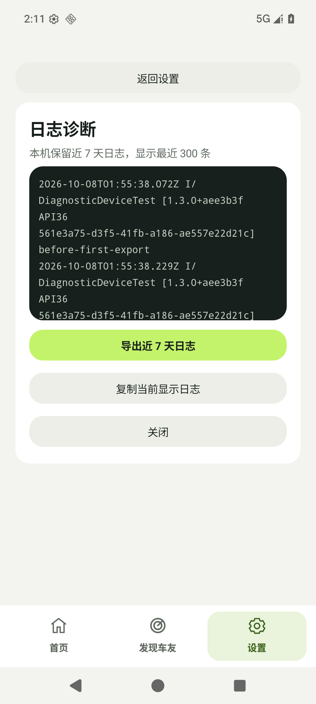

# KUM-62：近 7 天本机日志验证

2026-10-08，日志升级的实现、完整自动化和 API 36 模拟器检查通过。功能尚未合并或发布，六项骑行故障的诊断结论见 [排查汇总](../diagnosis/2026-10-08-field-v1.2.0/README.md)。

## 实现与来源

- Linear：[KUM-62](https://linear.app/kuma999/issue/KUM-62/日志诊断本机保留近-7-天日志并支持导出)。
- Base SHA：`0f5e7b778ee0b945725c9506055d6137a7faf546`。
- 已验证的应用源码 SHA：`b3d1250fb8851e73fb6daf9c2ee3dcb596a255e6`。
- 分支：`feat/kum-62-seven-day-local-logs`；后续提交补充证据与报告排版，并修正容量测试的跨平台边界取值，应用源码不变。
- Android 版本号、正式签名和产品状态决策未更改。

Application 启动即初始化后台日志 worker。Service 无界面监听时的日志、错误和音频来源，以及现有音频路由、VOX、焦点、连接与恢复诊断写入应用私有目录。页面展示最近 300 条，导出全部未过期记录。记录含原始版本/API/运行实例；导出头补充设备、导出时间与策略。

保留窗口为滚动 168 小时，历史预算 256 MiB。周期 VOX DEBUG 每 5 秒持久化一次，状态变化不采样，原 Logcat 输出频率保持。极端超额保留未过期历史并记录新日志缺口；队列满和磁盘异常返回明确失败，恢复后继续写入。导出为独立文件，至少保留 24 小时，下次导出清理过期文件，导出缓存预算 512 MiB。

## 自动化

在映射到正式工作区的 `M:\`、JDK `F:/Android/jbr` 运行：

```powershell
./gradlew.bat clean testDebugUnitTest lintDebug assembleDebug assembleDebugAndroidTest --console=plain
```

结果：`BUILD SUCCESSFUL`，97 个测试套件、750 个 JVM 测试，失败/错误/跳过均为 0；Lint 为 0 error、80 warning；debug 与 instrumentation APK 构建成功。

新增回归覆盖 168 小时边界、跨日连续在线维护、重建保留原版本、损坏尾行/备份恢复、并发、有界存储和缺口、七天常态预算、认证字段脱敏、队列饱和、磁盘恢复、两份导出互不覆盖及缓存预算、Application 启动、后台 Service 来源、界面重建与晚到回调、导出准备/失败重试。

P1 整改回归特别覆盖：初次维护中途读取失败后，同一 store 重新统计已有容量；在线维护留下 `.bak/.tmp` 后，同一 store 恢复；同一 worker 的读取与导出失败回调按时结束，故障解除后保留旧历史并继续工作。

Debug APK SHA256：`04B143FA1591DC02ECACD41DB781EC9FAEDA9861FA2F1D2A6FECFB724B46E887`。此 APK 仅用于本轮模拟器检查，不是正式分发包。

## Android 设备检查

设备：本轮启动的 `MotoIntercom_Graphics_API36_B` / `emulator-5556`。用户物理设备 `9688fa60` 为 unauthorized，未安装或操作该设备。

```powershell
adb -s emulator-5556 shell am instrument -w -r -e class com.kuma.motointercom.DiagnosticDeviceTest com.kuma.motointercom.instrumentation/androidx.test.runner.AndroidJUnitRunner
```

结果：`OK (1 test)`。两次导出后第一份 URI 仍可读且内容不变；Intent 与 ClipData 只授予读取；FileProvider 拒绝暴露私有历史目录。测试记录用独立标记，允许已有七天历史下重复运行。

UI 实际检查：覆盖安装后打开“设置 → 日志诊断”，可读取前一运行实例在 01:55 UTC 写入的历史；页面说明为“本机保留近 7 天日志，显示最近 300 条”；点击导出后系统选择器显示一份 `motocom-logs-…txt`。未选择接收方或发送。点击坐标依据每一步的 UI XML bounds。



此检查未覆盖双真机听音、头盔蓝牙路由或骑行。168 小时连续使用通过可控时钟文件测试验证，未声称模拟器实际运行了七天。

## 只读架构审查

`motointercom-product-architect` 对固定源码 SHA 的复核为 **APPROVED**，P0=0、P1=0。初版 `f374178` 的维护恢复 P1 已在 `b3d1250` 修复。

Non-blocking：导出缓存的 `listFiles()==null` 当前仍按空列表处理，可在后续完善该异常边界；不阻断当前自动化与 Draft PR 门禁。

Next gate allowed：独立 Draft PR、远端 CI 与证据收尾。主分支合并和发布保留为用户决定。

## 交付与远端 CI

[Draft PR #37](https://github.com/g95809080-cmyk/moto-intercom/pull/37) 已创建并关联 KUM-62，事项保持 In Review。`5670fdd` 的只读固定 SHA 审查同样 APPROVED，P0=0/P1=0。

[初轮远端 CI](https://github.com/g95809080-cmyk/moto-intercom/actions/runs/37716897647) 的 API 36 完整仪器测试 22/22 通过。JVM 750 项中仅容量测试失败：400 B 恰好等于 Linux 的两份导出总量，Windows 换行多出的字节使本机断言通过。测试预算改为 380 B，使第二份单独可容纳、两份合计明确超额；继续验证先前共享文件保留，没有更改生产容量规则。

容量取值修正后，本机完整 JVM/Lint/双 APK 门禁再次通过，750 项全通过；随后补充“单份新导出可容纳”的断言，`DiagnosticLogSessionTest` 5 项与 Lint 针对性检查通过。

后续远端结果以 PR 的最新固定 Head 检查为准，不用本机通过替代远端失败。合并及发布前应确认最新检查通过。
