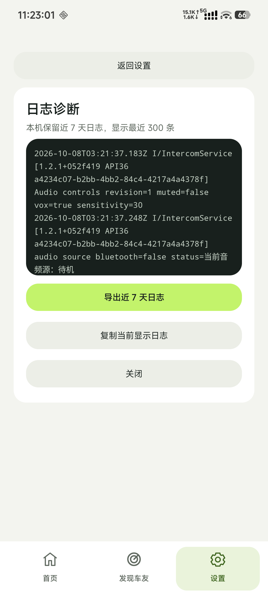
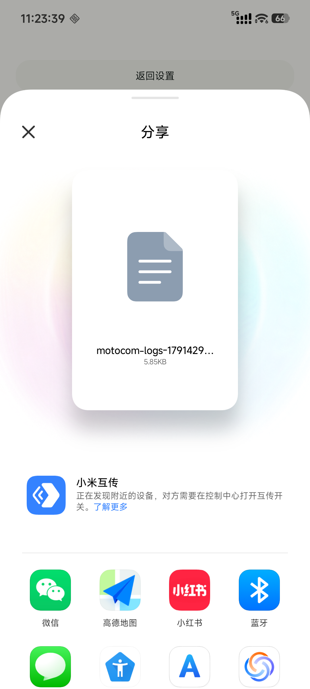

# KUM-63：v1.2.1 日志修复测试与小米 13 部署

2026-10-08，用户要求通过无线调试部署日志升级，并明确采用 1.2.1 修复测试编号。非调试测试包已覆盖安装至小米 13，保留原应用数据与权限；完整本机检查、固定 SHA 架构审查和源码 CI 通过。真机日志写入、强杀后重开留存和导出选择器检查通过。

## 源码与版本

- 基线：`v1.2.0` / `d479ec1dec5c4c197785d69b88d0872a366946cb`。
- 日志来源：已审查 KUM-62 / `41d2ee8881fdf2ef9739db64d163f408d99d01f9`。
- 获批功能 SHA：`052f419f484a0868ee2c4239a1913478a2c50425`。
- 构建 SHA：`3c36d1f935d1aa386dd7ad4b732925047b057ac7`；功能提交之后仅打包版本、JVM 测试堆、CI 分支与 README 说明变化，`app/src` 未再修改。
- 测试版本：`1.2.1+052f419` / Android `versionCode=5`。
- 分支：`fix/kum-63-v1.2.1-local-logs`；[Draft PR #38](https://github.com/g95809080-cmyk/moto-intercom/pull/38) 目标为 `maintenance/v1.2`，基线固定在 v1.2.0。
- Linear：[KUM-63](https://linear.app/kuma999/issue/KUM-63/v121-修复测试移植七天日志并部署小米-13)。

只移植近七天本机日志留存、近期展示、后台记录与完整文本导出。Service 六处事件新增记录，Activity 加入日志页生命周期；旧版音频、发现和恢复决策保持。1.3 群组、启动权限流程和音频就绪变化未进入本包。六项骑行故障尚未修复。本次没有创建正式 GitHub Release 或合并 main。

Android code 5 已用于这次分发，后续任意分发须使用 code 6 或更大，不因 SemVer 为 1.2.1 而回用较小的 code。

## 本机验证

JDK `F:/Android/jbr`，`M:` 映射到主工作区。先执行日志组件与 Activity/页面的必要回归，通过后执行：

```powershell
./gradlew.bat testDebugUnitTest lintDebug assembleDebug assembleDebugAndroidTest assembleRelease --console=plain
```

结果 `BUILD SUCCESSFUL`。73 个测试套件、588 个测试，failures/errors/skipped 均为 0；Lint 为 0 error、71 warning；debug、instrumentation 与 Release APK 构建通过。

只读 `motointercom-product-architect` 固定 Head `3c36d1f` 为 **APPROVED**，P0=0/P1=0；确认 v1.2.0 纯日志移植、Activity/Service 生命周期兼容，且打包提交未改动 app/src。Non-blocking：导出目录 listFiles()==null 的异常可后续明确报错。下一门禁允许签名核验后按用户授权覆盖安装并检查留存/导出；不代表骑行故障已通过验收。

## 安装包

- 文件：`output/MotoCom-v1.2.1-logs-test.apk`（位于主工作区父目录）。
- SHA256：`27FA977C2A302EA330EE4E776D53F7C31B7070C29CBA9B22D29A0A8955E7DDDD`。
- 签名证书 SHA256：`7F20F38DC1D7372CDE34CAC6E0E17D80EC995AC298C298FD0D24605E1A8070F3`。
- v1/v2/v3 签名验证通过，16 KiB ZIP 对齐验证通过；aapt2 确认 package `com.kuma.motointercom`、versionName `1.2.1+052f419`、code 5、targetSdk 36，无 debuggable 标记。

证书与从手机提取的 v1.2.0 APK 一致，旧包 SHA256 为 `34E2ACCFDA3497D168959C0F3C88C476CAC46A514913C3D51E262D1265B37F3E`。沿用历史个人分发证书，私钥未入库。

## 小米 13

设备：Xiaomi `2211133C`，Android 16 / API 36。ADB 无线覆盖安装 `install -r` 返回 `Success`。安装从 1.2.0/code3 升至 1.2.1+052f419/code5，更新时间 2026-10-08 11:03:21（设备本地时间）。

前后 User 0 的应用数据 inode 相同，firstInstallTime 均为 2026-08-07 13:55:47；原有 16 项已授予权限全部保留，其中麦克风、附近 Wi-Fi、蓝牙连接、通知及电话状态均 granted=true。未卸载或清除数据。

`am start -W` 返回 `Status: ok` / `LaunchState: COLD` / `TotalTime: 786ms`，应用进程保持运行。首次检查时手机处于 Dozing/息屏状态；用户解锁后继续完成如下检查。

单机测试临时关闭原本开启的自动重连，启动后状态为 Discovering、WebRTC 未连接，再停止服务，回到 Offline；没有连接另一台设备。原自动重连设置随后恢复为 true，VOX 和灵敏度 30、蓝牙首选均保留。

日志页可见 03:21:37 UTC 的 Service、音频引擎、Wi-Fi Direct 与 Activity 记录，原运行实例为 `a4234c07-b2bb-4bb2-84c4-4217a4a4378f`。执行 force-stop 后重开，PID 从 4631 变为 4632，冷启动 363ms；重新进入日志页，原始时间、版本/API 和运行实例记录仍可读。此次结果直接验证实机进程重启留存。

点击“导出近 7 天日志”后系统选择器显示 `motocom-logs-1791429817434-c5c283c5-be5e-49d6-ae70-043dad938f2b.txt`，文件大小约 5.85 KiB；未选择接收方或发送，关闭选择器后返回日志页。最终 Service 没有 isForeground=true 或 startRequested=true，应用当前进程无 crash buffer 记录。





手机的标准 uiautomator dump 多次因 idle 等待失败而无法完成。检查改用同一系统 UiAutomation / AccessibilityNodeInfoDumper 的临时 shell 工具直接获取当前 UI 树；点击始终依据 UI 树 bounds。辅助 dex 和快照文件已经从 /data/local/tmp 删除，没有额外安装辅助 App 或调整全局系统设置。

七天时长/边界通过可控时钟回归验证；本机实际检查仅覆盖上述短时使用与进程重启，不代表七天实骑、双机听音、蓝牙头盔兼容或六项现场故障已经验收。

## 远端验证

固定构建 SHA `3c36d1f935d1aa386dd7ad4b732925047b057ac7` 的 [Android CI 37720778305](https://github.com/g95809080-cmyk/moto-intercom/actions/runs/37720778305) 结果为 **success**，JVM/Lint/双 APK 构建和 API 36 完整仪器测试两个 job 均 success。后续提交只补充验证证据，未修改实际安装源码；合并前仍须检查 PR 最新 Head 的 GitHub 状态。
